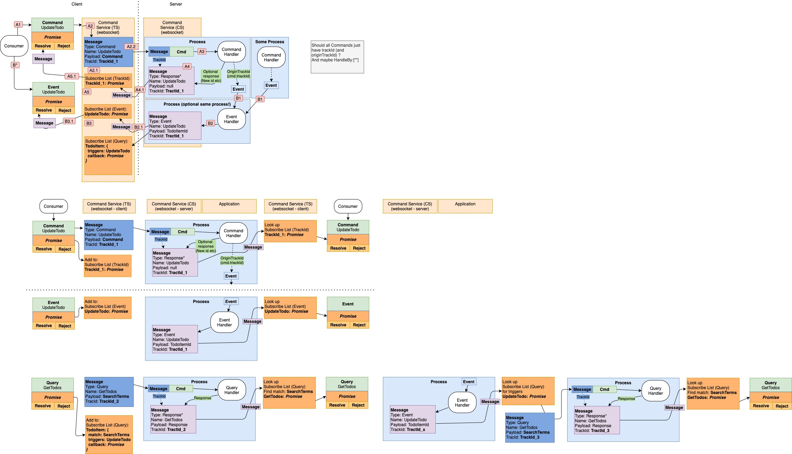

# Message Bridge (JS)

A CQRS Hook.

Extreme simplified Commands, Queries and Events for applications UI.

The Bridge enabled sending Commands, Queries and Event between a frontend and backend
through a websocket.

The pattern will remove the needs for controllers\* and hook directly into Commands, Queries and Events in the backend.

_\*This doesn't mean you don't want controller or need them to expose you API for other sources_


### Examples

```ts
// See "/tests" in repository for more examples
const bridge = new MessageBridgeService("ws://localhost:8080")
await bridge.connect()

// Command
const command = { name: "Remember to", priority: "low" } as ICreateTodo
const id = await bridge.sendCommand({
  module: "todo", // module is optional (But can be used to track different microservices etc..)
  name: "CreateTodo", // name of the command
  payload: command, // payload (arguments) of the command
})
console.log(`Todo created with id: ${id}`)

// Query
const todo = await bridge.sendQuery({
  name: "GetTotoItem", // name of the query
  payload: { id: 25 }, // payload (arguments) of the query
})
console.log(`Todo with id:25 has title: ${todo.title}`)

// Subscribe Event
const unsub = bridge.subscribeEvent({
  name: "TotoItemUpdated", // name of the event
  onEvent(todo: ITodoItem) {
    // event handler
  },
})
```

Tracked requests:

```ts
// tracked:
const { response, request, requestMessage } = await bridge.sendQueryTracked({
  name: "GetTotoItem",
  payload: { id: 25 },
})
console.log(
  `${requestMessage.type} ${requestMessage.name}: Todo with id ${request.id} has title '${response.title}'`,
)
// => `Query GetTotoItem: Todo with id 25 has title 'todo1'`
```

Multiple parallel requests:

```ts
let promise1 = bridge.sendCommand({
  name: "CreateTodo",
  payload: command,
})
let promise2 = bridge.sendCommand({
  name: "CreateTodoNode",
  payload: commandNote,
})
const [todo, note] = await Promise.all([promise1, promise2])
```

Multiple parallel tracked requests:

```ts
let requestList = [
  { name: "GetTotoItem", payload: { id: 25 } },
  { name: "GetNote", payload: { search: "remember" } },
  {...}
]
// convert to tracked requests
let promiseList = requestList.map(({name, payload}) =>
  bridge.sendQueryTracked({ name, payload })
)
const responses = await Promise.all(promiseList)
responses.forEach(({ response, request, requestMessage }) => {
  if(requestMessage.name === "GetTotoItem"){
    console.log(`Todo: ${response.title}`),
  }
  if(requestMessage.name === "GetNote"){
    console.log(`Note: ${response.title}`)
  }
})
```

See the tests in "/tests" (github) for examples of all features.

## Install

```
> npm i message-bridge-js
```

```
> yarn add message-bridge-js
```

## Backend

The backend must handle bridge messages and respond to with the correct **tractId** and type.

Type map:

- Command => CommandResponse
- Query => QueryResponse
- Event => No response
- <= Server Event can also be send from the backend to the frontend (use type Event)

An example of a backend implementation, can be found in the **InMemoryClientSideServer** _(in "/services" folder)_

Note it uses the helper methods in _MessageBridgeHelper.ts_ to create the messages. _(Primary **createMessage**)_

At some point in the future there will most likely be create official backend implementations for NodeJs and .NET Core.

> It's suggested to use some kind of CQRS pattern in the backend as well (Fx MediatR for asp.net core)

## Events (Responsive behavior)

The Bridge enabled the frontend to listen to events send from processes in the backend.

This enables the frontend to be responsive to changes in the backend, instead of polling.

## Technologies (dependencies)

The primary implementation uses [@microsoft/signalr](https://www.npmjs.com/package/@microsoft/signalr)

The base bridge class uses [uuid](https://www.npmjs.com/package/uuid)

## Bridge versions

The primary and most tested version is the SignalR version: **SignalRMessageBridgeService**

But there is also a websocket version: **WebSocketMessageBridgeService**

And an **ClientSideMessageBridgeService** that uses the **InMemoryClientSideServer** to get started fast without a backend.

## Internal - how it does it

The bridge sends BridgeMessage that contains a:

**Name** of the command, query or event

**Payload** that contains the actual Command/Query or payload for en Event for Error

**TrackId** that is used to catch responses

**Type** that are one of

- Command
- Query
- CommandResponse
- QueryResponse
- Event
- Error

The frontend will add a **trackId** which in the backend will be added in the responses.

The message is sent through a websocket and deserialize its payload in the backend.

The backend handles the Command/Query/Event and create a response message.  
The sent the response message back to the frontend including correct **type** and the **trackId**

The server can also send events to the frontend. _(without any prior request)_


### Flow diagram



# Bridge commands:

Most used commands:

- sendCommand
- sendQuery
- sendEvent _(It's called send because it will send it to the backend - not fire it! )_
- subscribeEvent
- connect

Tracked versions of requests (They resolve the promise with a full RequestResponse<TRequest,TResponse>)  
It includes the request and response messages (So you can track which request data what used to get the response)

- sendCommandTracked
- sendQueryTracked

Underlying commands _(can sometime be used to fetch trackId ect...)_

- sendMessage
- sendMessageTracked
- onError _(override to handle errors)_
- onClose _(override to handle close)_

Helper commands _(advanced use)_

- createCommandMessage
- createQueryMessage
- createEventMessage
- createMessage
- createMessageFromDto

Protected commands _(advanced use)_

- onMessage
- handleIncomingMessage
- receiveEventMessage
- internalSendMessage

## All features are fully tested

**jest** tests:  
<span style="background: green; color: #333; font-weight:bold; padding: 3px">PASS</span> <span style="color: #666;">tests/</span>bridgeOptions.test.ts  
<span style="background: green; color: #333; font-weight:bold; padding: 3px">PASS</span> <span style="color: #666;">tests/</span>fullFlow.test.ts  
<span style="background: green; color: #333; font-weight:bold; padding: 3px">PASS</span> <span style="color: #666;">tests/</span>logger.test.ts  
<span style="background: green; color: #333; font-weight:bold; padding: 3px">PASS</span> <span style="color: #666;">tests/</span>sendEvent.test.ts  
<span style="background: green; color: #333; font-weight:bold; padding: 3px">PASS</span> <span style="color: #666;">tests/</span>requestOptions.test.ts  
<span style="background: green; color: #333; font-weight:bold; padding: 3px">PASS</span> <span style="color: #666;">tests/</span>sendQuery.test.ts  
<span style="background: green; color: #333; font-weight:bold; padding: 3px">PASS</span> <span style="color: #666;">tests/</span>sendCommand.test.ts  
<span style="background: green; color: #333; font-weight:bold; padding: 3px">PASS</span> <span style="color: #666;">tests/</span>handleErrors.test.ts  
<span style="background: green; color: #333; font-weight:bold; padding: 3px">PASS</span> <span style="color: #666;">tests/</span>parallel.test.ts

Test Suites: <span style="color: green; ">9 passed</span>, 9 total  
Tests: <span style="color: green; ">37 passed</span>, 37 total

## Async vs Callback

You can use the bridge in two ways:

- with async/await (default and recommended)
- with callbacks.

```ts
// sendCommand and sendQuery can take a callback instead of awaiting the response
bridge.sendCommand({
  name: "CreateTodo",
  payload: command,
  onSuccess(id) {
    console.log(`Todo created with id: ${id}`)
  },
  onError(error) {
    // if the server send an bridge error message
    console.log(`Error: ${error}`)
  },
})
// or a combination to handle errors without try/catch
const id = await bridge.sendCommand({
  name: "CreateTodo",
  payload: command,
  onError(error) {
    // handle error
  },
})
```

## Handle errors

There are a couple of ways to handle errors.

By default the bridge will follow normal promise flow for _non-tracked_ requests (using try/catch)

```ts
try {
  const response = await bridge.sendCommand({
    name: "CreateTodo",
    payload: command,
  })
} catch (error) {
  // handle error
}
```

But this can be changed with the option: **avoidThrowOnNonTrackedError**

Tracked requests will **NOT** default to throw errors, but instead include it in the _RequestResponse_  
If an error is thrown or send from the backend (using the Error type with trackId),  
the response will be _undefined_ and the error will be set.

This behavior can be changed with the option: **throwOnTrackedError**

```ts
const { response, error, isError, errorMessage } = await bridge.sendCommandTracked({
  name: "CreateTodo",
  payload: command,
})
```

## Bridge options

```ts
// Ex:
bridge.setOptions({
  timeout: 10_000, // set timeout for all requests to 10 seconds
  avoidThrowOnNonTrackedError: true, // avoid throwing errors on non tracked requests
  onError: (err, eventOrData) => {
    // listen to all errors (manual handling of errors)
  },
  logMessageReceived: true // log all incoming messages (For debugging)
  logSendingMessage: true // log all outgoing messages (For debugging)
})
// BridgeOptions defined in MessageBridgeTypes.ts
export type BridgeOptions = {
  // add listeners
  onMessage?: (msg: Message) => void
  onSend?: (msg: Message) => void
  onError?: (err?: unknown /*Error*/, eventOrData?: unknown) => void
  onClose?: (err?: unknown /*Error*/, eventOrData?: unknown) => void
  onConnect?: () => void
  // handle errors and timeouts
  avoidThrowOnNonTrackedError?: boolean // (default: undefined)
  throwOnTrackedError?: boolean // (default: undefined)
  timeout?: number // (default: undefined)
  timeoutFromBridgeOptionsMessage?: (ms: number) => string // (has default implementation)
  timeoutFromRequestOptionsMessage?: (ms: number) => string // (has default implementation)
  // debugging
  logger?: (...data: any[]) => void // set custom logger (default: console?.log)
  logParseIncomingMessageError?: boolean // (default: true)
  logParseIncomingMessageErrorFormat?: (err: unknown) => any[] // (has default implementation)
  logMessageReceived?: boolean // log all messages received
  logMessageReceivedFormat?: (msg: Message) => any[] // (has default implementation)
  logSendingMessage?: boolean // log all messages sent
  logSendingMessageFormat?: (msg: Message) => any[] // (has default implementation)
  logMessageReceivedFilter?: undefined | string | RegExp // restrict logging to messages matching this filter
  logSendingMessageFilter?: undefined | string | RegExp // restrict logging to messages matching this filter
}
```

## Request options

You can set options for each request.

````ts
// Ex:
bridge.sendCommand({
  name: "CreateTodo",
  payload: command,
  timeout: 10_000
})


# Getting started

You can use the included **ClientSideMessageBridgeService** and **InMemoryClientSideServer**
to get started quickly (and later change the bridge to the **SignalR** or **Websocket** version).

See the tests for full examples in the "/tests" folder (Github).

```ts
// TestInterfaces.ts
export enum RequestType {
  GetTodoItemQuery = "GetTodoItemQuery",
  UpdateTodoItemCommand = "UpdateTodoItemCommand",
  TodoItemUpdated = "TodoItemUpdated",
}

export type Store = {
  todos: TodoItem[]
}

export type TodoItem = {
  id: number
  title: string
}
export type UpdateTodoItemCommandResponse = {
  done: boolean
}
export type UpdateTodoItemCommand = {
  id: number
  title: string
  throwError?: boolean
  sleep?: number
}
export type GetTodoItemQueryResponse = {
  items: TodoItem[]
}

export type GetTodoItemQuery = {
  search: string
  throwError?: boolean
  sleep?: number
}
````

```ts
// TestServer.ts
import { InMemoryClientSideServer } from "message-bridge-js"
import { RequestType, Store } from "./TestInterfaces"

let server = new InMemoryClientSideServer<Store>()
server.store.todos = [
  { id: 1, title: "todo1" },
  { id: 2, title: "todo2" },
  { id: 3, title: "todo3" },
]
server.addCommand(RequestType.UpdateTodoItemCommand, ({ event, response }) => {
  const todo = server.store.todos.find((t) => t.id === opt.requestMessage.payload.id)
  if (todo) {
    todo.title = opt.requestMessage.payload.title
  }
  setTimeout(() => {
    event(RequestType.TodoItemUpdated, {
      id: opt.requestMessage.payload.id,
      title: opt.requestMessage.payload.title,
    })
  }, 10)
  response({ done: true })
})
server.addQuery(RequestType.GetTodoItemQuery, ({ response }) => {
  const items = server.store.todos.filter((t) =>
    t.title.toLowerCase().includes(opt.requestMessage.payload.search.toLowerCase()),
  )
  response({ items })
})

export { server as testServer }
```

```ts
// TestClient.ts
import { ClientSideMessageBridgeService } from "message-bridge-js"
import { RequestType } from "./TestInterfaces"
import { server } from "./TestServer"

const bridge = new ClientSideMessageBridgeService("ws://localhost:1234") // dummy url
bridge.server = server

// interact with the (fake inMemory) server
const response = await bridge.sendQuery<GetTodoItemQuery, GetTodoItemQueryResponse>({
  name: RequestType.GetTodoItemQuery,
  payload: {
    search: "todo",
  },
})

await bridge.sendCommand<UpdateTodoItemCommand, UpdateTodoItemCommandResponse>({
  name: RequestType.UpdateTodoItemCommand,
  payload: {
    id: 1,
    title: "todo1 changed",
  },
})
```

## React hook example

The bridge can be used with any frontend framework, but here is an example of how to use it with React hooks.

```ts
function useGetTodo(id: number): Promise<TodoItem | undefined> {
  const [todo, setTodo] = useState<TodoItem | undefined>()
  useEffect(async () => {
    const todos = await bridge.sendQuery<GetTodoItemQuery, GetTodoItemQueryResponse>({
      name: RequestType.GetTodoItemQuery,
      payload: { id },
    })
    setTodo(todos?.[0])
    const unsub = bridge.subscribeEvent<TodoItemUpdatedEvent>({
      name: RequestType.TodoItemUpdated,
      onEvent: (todoEvent) => {
        if (event.id === id) {
          setTodo((todo) => ({
            ...todo,
            title: todoEvent.title,
          }))
        }
      },
    })
    return () => unsub()
  }, [id])
  return todo
}

function useUpdateTodo() {
  const updateTodo = useCallback(async (id: number, title: string) => {
    await bridge.sendCommand<UpdateTodoItemCommand, UpdateTodoItemCommandResponse>({
      name: RequestType.UpdateTodoItemCommand,
      payload: { id, title },
    })
  }, [])
  return updateTodo
}
```
